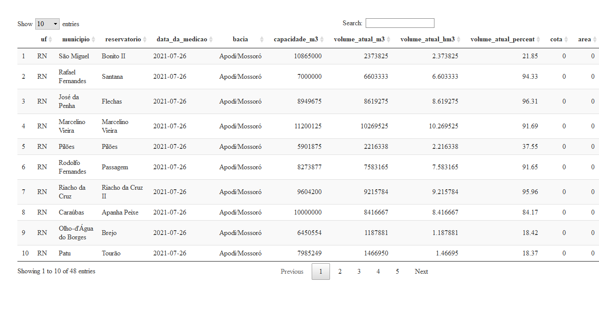
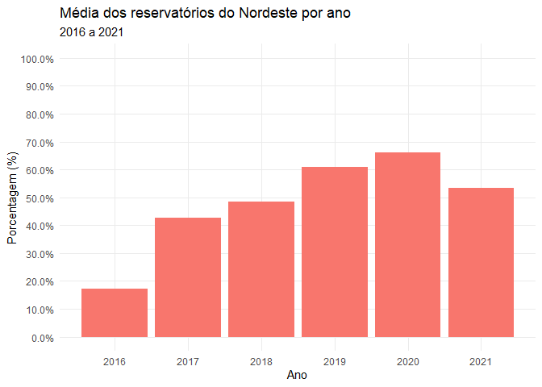
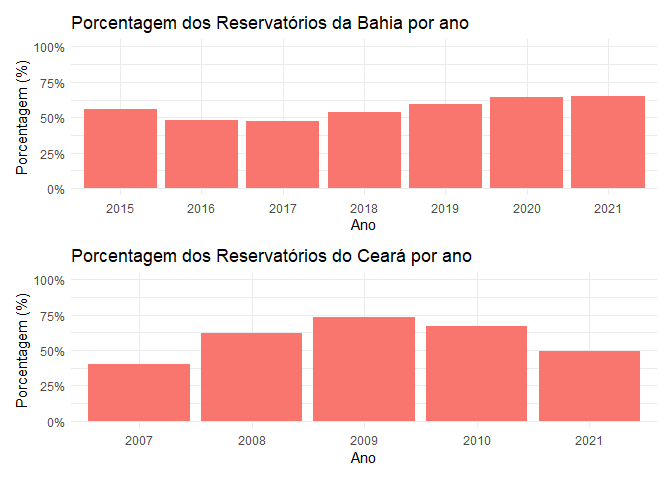

<!-- README.md is generated from README.Rmd. Please edit that file -->

# Trabalho Final de Web Scraping do Théo (tfwbt)

<!-- badges: start -->

[](https://github.com/theoadepaula/tfwbt/actions)
<!-- badges: end -->

O objetivo do pacote tfwbt é para utilizar os conhecimentos aprendidos
no curso de web scraping do [Curso R](https://curso-r.com/) e aplicar na
obtenção dos dados dos reservatórios hídricos fornecidos pelas
secretarias estaduais de meio ambiente ou relacionados ao meio ambiente.

A motivação dessa aplicação é para pegar os dados de forma rápida para
alimentação do sistema utilizado no meu trabalho, que verifica o nível
dos reservatórios das bacias hidrográficas e/ou dos estados. Para o
recorte do trabalho, serão obtidos dados dos alguns dos estados do
Nordeste, que não estão sob os cuidados do
[DNOCS](https://www.gov.br/dnocs/pt-br) ou da
[ANA](https://www.gov.br/ana/pt-br), além de um reservatório que fica em
Minas Gerais, que faz parte da Bacia do São Francisco.

## Instalação do pacote

O pacote pode ser instalado pelo [GitHub](https://github.com/) pelos
comandos abaixo:

``` r
# install.packages("devtools")
devtools::install_github("theoadepaula/tfwbt")
```

## Funções do pacote

Para um maior detalhamento, são esses os estados que terão os dados
captados:

-   Bahia
-   Ceará
-   Minas Gerais
-   Paraíba
-   Pernambuco
-   Rio Grande do Norte
-   Sergipe

### Bahia

A função para pegar os dados do estado do Bahia é o get\_data\_ba(), que
necessita de link que fica no site do
[INEMA](http://www.inema.ba.gov.br), na parte de [informativo semanal de
monitoramento de
barragens](http://www.inema.ba.gov.br/gestao-2/barragensreservatorios/informativo-semanal-de-monitoramento-das-barragens/).

A tabela gerada pela função é extraída do link informado, que é um PDF.
O passo a passo pode ser visto dentro do link da função get\_data\_ba().

``` r
library(tfwbt)
library(DT)
## basic example code

get_data_ba('http://www.inema.ba.gov.br/wp-content/uploads/2021/07/INFORMATIVO-SEMANAL-N%C2%BA-29-2021.pdf') %>% 
  DT::datatable()
```


### Ceará

A função para pegar os dados do estado do Ceará é o get\_data\_ce(), que
utiliza o link que fica no site da [FUNCEME](http://www.funceme.br/), na
parte do [Portal Hidrológico](http://www.hidro.ce.gov.br/).

A tabela gerada pela função é extraída do XML fornecido pela página. Ela
possui uma API escondida, que requer como query um epoch, marcador de
tempo em números inteiros. O passo a passo pode ser visto dentro do link
da função get\_data\_ce().

``` r
library(tfwbt)
## basic example code

get_data_ce()%>% 
  DT::datatable()
```


### Minas Gerais

A função para pegar os dados da barragem Bico de Pedra, que fica no
estado de Minas Gerais, é o get\_data\_mg(), que precisa do link que
fica no site do [Distrito de Irrigação do Perímetro
Gorutuba](http://www.dig.org.br/home).

A tabela gerada pela função é extraída pela tabela html fornecida pela
página. O passo a passo pode ser visto dentro do link da função
get\_data\_mg().

``` r
library(tfwbt)
## basic example code

get_data_mg('http://www.dig.org.br/noticia/Junho-2020-distrito-do-gorutuba/251/')%>% 
  DT::datatable()
```


### Paraíba

A função para pegar os dados do estado do Paraíba é o get\_data\_pb(),
que utiliza internamente o link que fica no site da
[AESA](http://www.aesa.pb.gov.br/).

A tabela gerada pela função é extraída do JSON fornecido pela página.
Ela possui uma API escondida, que requer como query um epoch, marcador
de tempo em números inteiros, como o estado do Ceará. O passo a passo
pode ser visto dentro do link da função get\_data\_pb().

``` r
library(tfwbt)
## basic example code

get_data_pb()%>% 
  DT::datatable()
```


### Pernambuco

A função para pegar os dados do estado de Pernambuco é o
get\_data\_pe(), que usa o link que fica no site da
[APAC](https://www.apac.pe.gov.br/), na parte de [monitoramento de
boletins de reservatórios
hidrológicos](https://www.apac.pe.gov.br/rios-e-reservatorios).

A tabela gerada pela função é extraída do PDF, que vem do link
fornecido. O passo a passo pode ser visto dentro do link da função
get\_data\_pe().

``` r
library(tfwbt)
## basic example code

get_data_pe('https://www.apac.pe.gov.br/uploads/Boletim-Monitoramento-Reservatorios26-07-2021.pdf')%>% 
  DT::datatable()
```


### Rio Grande do Norte

A função para pegar os dados do estado de Rio Grande do Norte é o
get\_data\_rn(), que usa o link que fica no site da
[SEARN](http://www.searh.rn.gov.br/), na parte de [Situação Volumétrica
de Reservatórios do
RN](http://sistemas.searh.rn.gov.br/MonitoramentoVolumetrico/).

A tabela gerada pela função é extraída pela tabela html fornecida pela
página, como no caso da barragem Bico da Pedra - MG. O passo a passo
pode ser visto dentro do link da função get\_data\_rn().

``` r
library(tfwbt)
## basic example code

get_data_rn()%>% 
  DT::datatable()
```



### Sergipe

A função para pegar os dados do estado de Rio Grande do Norte é o
get\_data\_se(), que usa o link que fica no site da
[SEDURBS](https://sedurbs.se.gov.br/), na parte do [Portal de Recursos
Hídricos](https://sedurbs.se.gov.br/portalrecursoshidricos/).

A tabela gerada pela função é extraída do PDF, que vem do link
fornecido, como os estados da Bahia e Pernambuco. O passo a passo pode
ser visto dentro do link da função get\_data\_se().

``` r
library(tfwbt)
## basic example code

get_data_se('https://sedurbs.se.gov.br/portalrecursoshidricos/gerenciamento/boletins_reservatorio/Boletim%2027-%2005_07_2021.pdf')%>% 
  DT::datatable()
```


## Aplicação dos dados

Foram geradas tabelas de dados e gravadas no nome do reservatorios + UF,
levando o histórico possível registrado nos sites até agora. A partir
dessas tabelas, podemos verificar os níveis de reservatórios por estado
e ver qual é a situação que se encontram.

As informações coletadas infelizmente não se mostram consistentes e nem
periódicas, pois em alguns estados são apresentados dados de 2019 em
diante, e no caso do Rio Grande do Norte, só mostra o dado do momento
atual, não sendo possível resgatar o histórico. No caso do Ceará, foi
possível resgatar o histórico de 2007 a 2010, e depois 2021.

Para isso, foi preciso puxar as informações de data, nome do
reservatório, percentual do volume útil do reservatório e acrescentar a
UF que se encontra. Em alguns bancos de dados foram ajustados erros que
poderiam comprometer a análise.

Levando isso em conta, e sem poder extrapolar para fazer uma afirmação
mais contundente, vamos olhar os níveis de reservatórios.

``` r
library(dplyr)
#> 
#> Attaching package: 'dplyr'
#> The following objects are masked from 'package:stats':
#> 
#>     filter, lag
#> The following objects are masked from 'package:base':
#> 
#>     intersect, setdiff, setequal, union
library(ggplot2)
library(forcats)
library(lubridate)
#> 
#> Attaching package: 'lubridate'
#> The following objects are masked from 'package:base':
#> 
#>     date, intersect, setdiff, union
library(tidyr)

volume_ba <- reservatorios_ba %>% 
  select(data,reservatorio,volume_util_percent) %>% 
  mutate(uf='BA',
         volume_util_percent=if_else(volume_util_percent==771.90,71.90,
                                     volume_util_percent),
         volume_util_percent=if_else(volume_util_percent==743.55,74.35,
                                     volume_util_percent)
         )

volume_ce <- reservatorios_ce %>% 
  select(data,reservatorio=acude,volume_util_percent=volume_pc) %>% 
  mutate(uf='CE')

volume_pb <- reservatorios_pb %>% 
  select(data,reservatorio=acude,volume_util_percent=volume_total_percent) %>% 
  mutate(volume_util_percent=round(as.numeric(volume_util_percent),2),
         data=ymd(data),
         uf='PB')

volume_pe <- reservatorios_pe %>% 
  select(data,reservatorio,volume_util_percent=percent_volume) %>% 
  mutate(uf='PE')

volume_rn <- reservatorios_rn %>% 
  select(data=data_da_medicao,reservatorio,volume_util_percent=volume_atual_percent) %>% mutate(uf='RN')

volume_se <- reservatorios_se %>% 
  select(data,reservatorio,volume_util_percent) %>%
  drop_na(data) %>% 
  mutate(uf='SE',
         volume_util_percent=if_else(volume_util_percent==1000,100,volume_util_percent))

volume_ne <- bind_rows(volume_ba,volume_ce,volume_pb,volume_pe,volume_rn,volume_se)
```

## Média Histórica

Para uma análise mais geral, foi feito um agrupamento dos dados por UF e
uma média das informações de todas as datas disponíveis. Essa média não
leva em conta o volume de cada reservatório, pois nem todos os estados
fornecem o volume total para ser calculado o peso adequado para fazer a
média ponderada.

Vemos que a média dos estados do Rio Grande do Norte e Paraíba rondam
perto de 42% e do estado de Sergipe de 83%. Os outros estados se
aproximam de média geral, próximos de 56%.

``` r
media_reservatorios_uf <- volume_ne %>% 
  group_by(uf) %>% 
  summarise(media_reservatorios=mean(volume_util_percent,na.rm=T) %>% 
              round(2)) 

media_reservatorios_uf <- media_reservatorios_uf %>% 
  bind_rows(tibble(uf='Total',media_reservatorios=mean(media_reservatorios_uf$media_reservatorios)))

media_reservatorios_uf %>% 
knitr::kable(digits = 2)
```

| uf    | media\_reservatorios |
|:------|---------------------:|
| BA    |                56.17 |
| CE    |                56.11 |
| PB    |                41.34 |
| PE    |                54.47 |
| RN    |                42.78 |
| SE    |                82.89 |
| Total |                55.63 |

``` r
  
media_reservatorios_uf %>% 
  filter(uf!='Total') %>% 
  ggplot(aes(x=fct_reorder(uf,media_reservatorios),y=media_reservatorios/100,
             fill=uf)
         )+
  geom_col(show.legend = FALSE) +
  scale_y_continuous(labels = scales::percent)+
  theme_minimal() +
  labs(title='Média histórica dos reservatórios por UF',
       y='Porcentagem (%)',
       x='UF' )
```


## Média por ano

Fazendo agora uma análise por ano, foram agrupados os dados por ano e
logo após a média da percentagem do volume útil. Lembrando que somente o
estado da Paraíba forneceu dados de um longo período de tempo, fazendo
que o gráfico mostrasse uma distorção de informação e mostrando dados
mais confiáveis entre 2019 e 2021.

Nos seis últimos anos podemos ver uma tendência de recuperação que foi
interrompido pelo ano de 2021. Mesmo que as informações não sejam tão
consistentes, devemos observar de perto como os reservatórios estarão.

``` r
library(knitr)

media_ano <- volume_ne %>% 
  group_by(ano=year(data)) %>% 
    summarise(media_reservatorios=mean(volume_util_percent,na.rm=T) %>% 
              round(2))

media_ano <- media_ano %>% 
  mutate(ano=as.character(ano)) %>% 
  bind_rows(tibble(ano='Total',
                   media_reservatorios=mean(media_ano$media_reservatorios)))

media_ano %>% 
knitr::kable(digits = 2)
```

| ano   | media\_reservatorios |
|:------|---------------------:|
| 1967  |                95.57 |
| 1968  |                95.10 |
| 1972  |                95.87 |
| 1973  |                96.03 |
| 1974  |                96.23 |
| 1975  |                97.70 |
| 1976  |                95.83 |
| 1978  |                96.35 |
| 1979  |                86.13 |
| 1980  |                70.17 |
| 1981  |                93.50 |
| 1982  |                77.63 |
| 1983  |                66.23 |
| 1984  |                95.27 |
| 1985  |                95.37 |
| 1986  |                95.63 |
| 1987  |                90.50 |
| 1988  |                92.90 |
| 1989  |                96.20 |
| 1990  |                84.97 |
| 1991  |                83.37 |
| 1992  |                85.07 |
| 1993  |                59.13 |
| 1994  |                39.35 |
| 1995  |                50.25 |
| 1996  |                54.20 |
| 1997  |                44.68 |
| 1998  |                28.18 |
| 1999  |                29.92 |
| 2000  |                51.31 |
| 2001  |                33.99 |
| 2002  |                39.31 |
| 2003  |                30.02 |
| 2004  |                65.88 |
| 2005  |                54.94 |
| 2006  |                54.39 |
| 2007  |                41.71 |
| 2008  |                65.13 |
| 2009  |                76.12 |
| 2010  |                55.91 |
| 2011  |                67.99 |
| 2012  |                39.44 |
| 2013  |                28.06 |
| 2014  |                23.11 |
| 2015  |                18.49 |
| 2016  |                17.31 |
| 2017  |                42.77 |
| 2018  |                48.54 |
| 2019  |                60.90 |
| 2020  |                65.99 |
| 2021  |                53.28 |
| Total |                65.14 |

``` r
media_ano %>% 
  filter(ano!='Total') %>% 
ggplot(aes(x=as.integer(ano),y=media_reservatorios/100,group=1))+
  geom_line()+
  expand_limits(y=c(0,1))+
  scale_x_continuous(breaks = seq(1965,2021,5))+
  scale_y_continuous(breaks = seq(0,1,.1), labels = scales::percent)+
  theme_minimal()+
  theme(panel.grid.minor = element_blank())+
    labs(title='Média dos reservatórios do Nordeste por ano',
       y='Porcentagem (%)',
       x='Ano' )
```


``` r

media_ano %>% 
  filter(ano!='Total',
         as.integer(ano)>2015) %>% 
ggplot(aes(x=as.integer(ano),y=media_reservatorios/100,fill='red'))+
  geom_col(show.legend = FALSE)+
  expand_limits(y=c(0,1))+
  scale_y_continuous(breaks = seq(0,1,.1), labels = scales::percent)+
  scale_x_continuous(breaks = seq(2016,2021,1))+
  theme_minimal()+
  theme(panel.grid.minor = element_blank())+
    labs(title='Média dos reservatórios do Nordeste por ano',
         subtitle = '2016 a 2021',
       y='Porcentagem (%)',
       x='Ano' )
```



## Média por UF e ano

Para uma última análise, serão analisados os gráficos por UF e ano.
Podemos ver que para o estado da Bahia, o nível dos reservatórios
apresenta uma variação pequena em torno dos 50%. No estado do Ceará, em
2009 apresentou a maior porcentagem de cheia de reservatório, e em 2021
ronda perto de 50%.

No caso do estado da Paraíba, vemos que até 1992 os níveis dos
reservatórios ficam com porcentagens altas, possivelmente por ter dados
de poucos reservatórios, e está abaixo de 50% em 2021. No estado de
Pernambuco, a média dos reservatórios fica próximo de 50% e no Rio
Grande do Norte está abaixo de 50%.

As médias mais altas de porcentagem de reservatórios se encontra em
Sergipe. Estão acima de 70%, sendo o pior ano até agora em 2021.

``` r
library(patchwork)

media_uf_ano <- volume_ne %>% 
  group_by(uf,ano=year(data)) %>% 
    summarise(media_reservatorios=round(mean(volume_util_percent,na.rm=T)/100,2))
#> `summarise()` has grouped output by 'uf'. You can override using the `.groups` argument.

theme_set(theme_minimal())

plot_ba <- 
  media_uf_ano %>% 
  filter(uf=='BA') %>% 
  ggplot(aes(factor(ano),media_reservatorios,group=uf,fill=uf))+
  geom_col(show.legend = FALSE) +
  expand_limits(y=c(0,1))+
  scale_y_continuous(labels = scales::percent)+
  labs(
    title='Porcentagem dos Reservatórios da Bahia por ano',
    x='Ano',
    y='Porcentagem (%)')

plot_ce <- 
media_uf_ano %>% 
  filter(uf=='CE') %>% 
  ggplot(aes(factor(ano),media_reservatorios,group=uf,fill=uf))+
  geom_col(show.legend = FALSE) +
  expand_limits(y=c(0,1))+
  scale_y_continuous(labels = scales::percent)+
  labs(
    title='Porcentagem dos Reservatórios do Ceará por ano',
    x='Ano',
    y='Porcentagem (%)')

plot_pb <- 
media_uf_ano %>% 
  filter(uf=='PB') %>% 
  ggplot(aes(factor(ano),media_reservatorios,group=uf,fill=uf))+
  geom_col(show.legend = FALSE) +
  expand_limits(y=c(0,1))+
  scale_y_continuous(labels = scales::percent)+
  labs(
    title='Porcentagem dos Reservatórios de Paraíba por ano',
    x='Ano',
    y='Porcentagem (%)')+
  theme(
    axis.text.x = element_text(size = 6, angle = 45)
  )

plot_pe <- 
media_uf_ano %>% 
  filter(uf=='PE') %>% 
  ggplot(aes(factor(ano),media_reservatorios,group=uf,fill=uf))+
  geom_col(show.legend = FALSE) +
  expand_limits(y=c(0,1))+
  scale_y_continuous(labels = scales::percent)+
  labs(
    title='Porcentagem dos Reservatórios de Pernambuco por ano',
    x='Ano',
    y='Porcentagem (%)')

plot_rn <- 
media_uf_ano %>% 
  filter(uf=='RN') %>% 
  ggplot(aes(factor(ano),media_reservatorios,group=uf,fill=uf))+
  geom_col(show.legend = FALSE) +
  expand_limits(y=c(0,1))+
  scale_y_continuous(labels = scales::percent)+
  labs(
    title='Porcentagem dos Reservatórios de Rio Grande do Norte por ano',
    x='Ano',
    y='Porcentagem (%)')


plot_se <- 
media_uf_ano %>% 
  filter(uf=='SE') %>% 
  ggplot(aes(factor(ano),media_reservatorios,group=uf,fill=uf))+
  geom_col(show.legend = FALSE) +
  expand_limits(y=c(0,1))+
  scale_y_continuous(labels = scales::percent)+
  labs(
    title='Porcentagem dos Reservatórios de Sergipe por ano',
    x='Ano',
    y='Porcentagem (%)')
  

plot_ba/plot_ce
```



``` r
plot_pb
```


``` r
plot_pe/plot_rn
```


``` r
plot_se
```


## Conclusão

Apesar de ter dados incompletos e não constantes, a iniciativa de reunir
em um só lugar dados sobre reservatórios do Nordeste pode chamar a
atenção de como a água está sendo armazenada. Isso pode levar a fazer um
planejamento de preservação da água e uso com melhor eficiência desse
recurso.

Há órgãos como [DNOCS](https://www.gov.br/dnocs/pt-br) e
[ANA](https://www.gov.br/ana/pt-br), que possuem dados mais estruturados
e organizados, e podem auxiliar melhor a análise dos níveis dos
reservatórios da região. Tudo isso deve estar disponível para que
melhores políticas públicas sejam elaboradas, de modo que toda a
população seja beneficiada.
